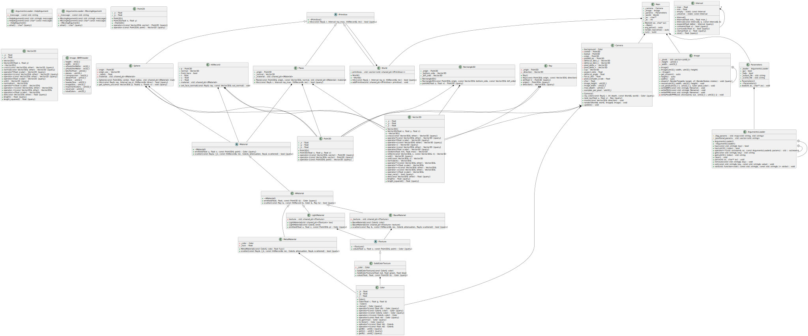

# Raytracer
- **Contributors:**
  - [Léo Wehrle - Rentmeister](https://github.com/leoWherle)
  - [Théodore Magna](https://github.com/TheodoreEpitech)

## Description


## Install
```bash
./build.sh release # to build as release
./build.sh debug # to build as debug
```

## Documentation
You can read the documentation by navigating to the `gh-pages` branch and opening the `index.html` file in your browser.


## Usage
```bash
./raytracer [scene_file]
```

## UML

