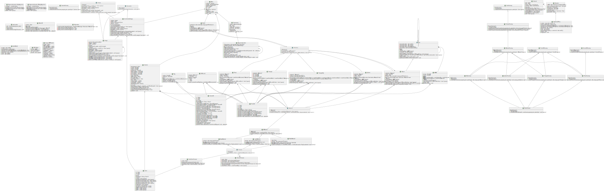

# Raytracer
- **Contributors:**
  - [Léo Wehrle - Rentmeister](https://github.com/leoWherle)
  - [Théodore Magna](https://github.com/TheodoreEpitech)

## Description

Raytracer is a rendering engine designed to generate high-quality images by simulating the way light interacts with objects in a scene. It supports loading and rendering complex 3D models, including OBJ files, and allows for detailed scene configuration. The project includes various features such as customizable materials, lighting, and camera settings. It is built using C++ and leverages libraries like Boost for property tree parsing. The project also provides comprehensive documentation and example scenes to help users get started.

## Install
```bash
./build.sh release # to build as release
./build.sh debug # to build as debug
```

## Documentation
You can read the documentation by navigating to the `gh-pages` branch and opening the `index.html` file in your browser.

for more information about the scene creation, you can read the [scene creation documentation](doc/scene_creation.md)


## Usage
```bash
./raytracer [scene_file]
```

## Result examples


### Obj models
***4000 triangles monkey***


```
render time = ~1h30
ray per pixel = 1 000
max depth = 30
```

-------

```
render time = ~12h
ray per pixel = 30 000
max depth = 100
```


## UML

